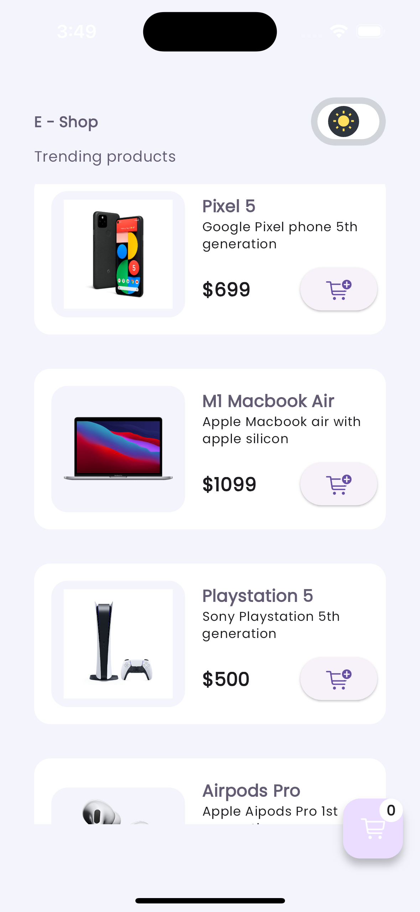
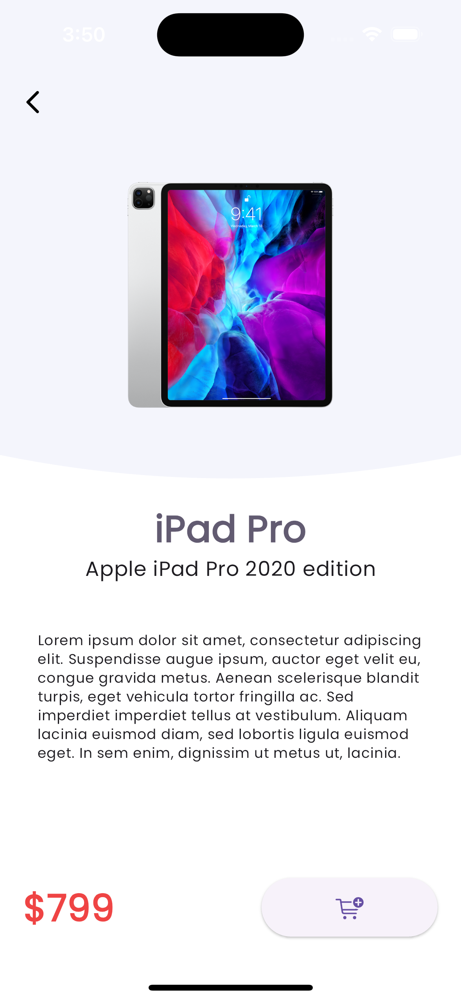
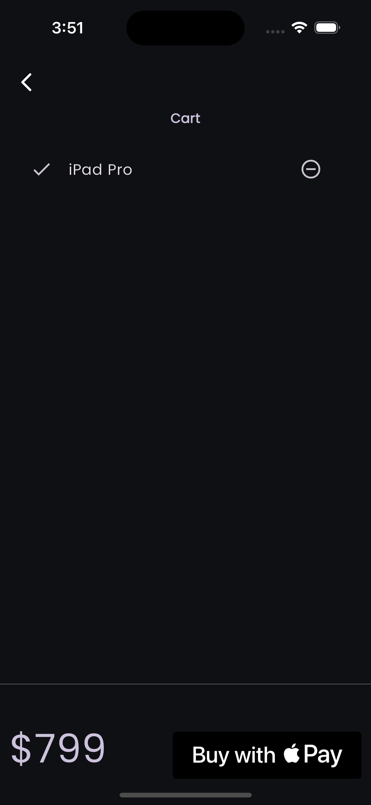

# flutter_e_shop_app

Este repositorio contiene la aplicación `E-Shop`, desarrollada en Flutter. El objetivo principal es diseñar e implementar una aplicación de comercio electrónico completa, que incluye funcionalidades como un carrito de compras y la integración de métodos de pago nativos.

## Imágenes del Proyecto

Aquí puedes ver algunas capturas de pantalla del proyecto en funcionamiento:

  
  
  

## Objetivos

### 1. Diseño e Implementación

- **Diseñar e implementar** una aplicación de comercio electrónico completa utilizando Flutter.
- Crear **interfaces de usuario intuitivas y atractivas**, asegurando una excelente experiencia de usuario.
- Implementar una **navegación fluida** y eficiente a través de la aplicación.
- Gestionar el **estado de la aplicación** utilizando patrones y manejadores de estado en Flutter.

### 2. Integración y Optimización

- **Integrar una API de pago**, permitiendo transacciones seguras y rápidas dentro de la aplicación.
- Desarrollar un **carrito de compras funcional**, que permita a los usuarios añadir, eliminar y modificar productos fácilmente.
- Optimizar el rendimiento de la aplicación para manejar **altas cargas de datos**, asegurando una experiencia de usuario sin interrupciones.

## Estructura del Proyecto

El proyecto sigue una arquitectura modular que facilita la escalabilidad y el mantenimiento de la aplicación. Dentro de la carpeta `lib`, se organiza en las siguientes secciones:

- **core**: Contiene la configuración general de la aplicación, como temas, rutas, y otros elementos globales.
- **models**: Define las clases y modelos de datos utilizados en la aplicación.
- **pages**: Incluye las diferentes pantallas de la aplicación, organizadas por funcionalidades.
- **utils**: Contiene utilidades y funciones auxiliares que facilitan diversas operaciones en la aplicación.
- **widgets**: Componentes reutilizables de la interfaz de usuario que pueden ser utilizados en múltiples partes de la aplicación.

## Tecnologías Utilizadas

- **Flutter**: Framework principal para el desarrollo de la aplicación.
- **Dart**: Lenguaje de programación utilizado para la lógica de la aplicación.
- **VelocityX**: [VelocityX](https://pub.dev/packages/velocity_x) - Un framework de diseño para Flutter que facilita el desarrollo de UI.
- **Google Fonts**: [Google Fonts](https://pub.dev/packages/google_fonts) - Acceso fácil a fuentes de Google en Flutter.
- **Pay**: [Pay](https://pub.dev/packages/pay) - Integración de métodos de pago como Google Pay y Apple Pay.
- **Flutter Switch**: [Flutter Switch](https://pub.dev/packages/flutter_switch) - Un widget para crear switches personalizados en Flutter.
- **Provider**: [Provider](https://pub.dev/packages/provider) - Una solución de gestión de estado y dependencia en Flutter.
- **API de Pago**: Integración para gestionar transacciones dentro de la aplicación.

## Instalación y Configuración

1. **Clona este repositorio**:
   ```bash
   git clone https://github.com/juniiormediina/flutter-e-shop-app.git
   ```
2. **Instala dependencias**:
   ```bash
   flutter pub get
   ```
3. **Ejecuta la aplicación en tu dispositivo o emulador**:
   ```bash
   flutter run
   ```
